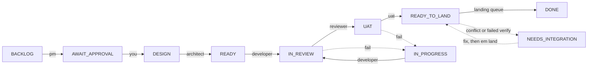

# emorg

[](https://github.com/temmyjay001/engineering-manager/actions/workflows/ci.yml)

A local engineering org run by isolated AI agents. Each role is a separate, locked-down agent session with its own system prompt, tool set, and model. The work moves through a real ticket lifecycle with gates that code cannot skip: a ticket reaches READY_TO_LAND only after an independent review and UAT both pass, then enters a serialized landing queue before it can reach DONE.

The point is structure. No single agent designs, writes, reviews, and signs off on its own work. Separation of duties is enforced by the tools each role is given, not by asking nicely: the reviewer's session has no edit tools at all, the developer cannot grade its own work, file writes outside a ticket's worktree are denied at the permission layer, and gate roles (reviewer, UAT, custom gates) cannot even read outside the worktree they are judging.

## How it works



Failed gates loop back to the developer with the exact defect report, and a ticket goes to BLOCKED for you after `maxAttempts` rounds.

| Role | Job | Tools |
| ---- | --- | ----- |
| PM | Turn a request into a ticket with testable acceptance criteria | Read, Grep, Glob |
| Architect | Produce an implementation plan against the real code | Read, Grep, Glob |
| Developer | Implement to the plan in an isolated git worktree | Read, Grep, Glob, Write, Edit, Bash |
| Reviewer | Judge the diff. Cannot edit or run | Read, Grep, Glob |
| UAT | Verify the running software against the criteria | Read, Grep, Glob, Bash, Playwright browser |

The **acceptance criteria** written by the PM are the contract. The architect plans to them, the developer builds to them, and UAT verifies against them and nothing else. You approve them before any work starts, so the org never efficiently builds the wrong thing.

Every role returns a schema-validated structured result (verdicts, findings, per-criterion evidence) through the harness, not free text, so a malformed response never corrupts the pipeline.

For tickets with a UI, UAT gets a real browser through the Playwright MCP server: it launches the app, drives the interface, and confirms each UI criterion by looking at what is actually rendered, screenshotting as evidence. Those screenshots are stored as EVIDENCE artifacts in the database and rendered on the ticket page, so you can see what the verifier saw long after the scratch directory is cleaned up.

## Setup

Requires Node 20.12+ and git.

```bash
npm install -g emorg
cd /path/to/your/project   # the repo the org should build in
em init
em doctor                  # verify the environment
```

To run from a clone instead:

```bash
git clone https://github.com/temmyjay001/engineering-manager.git && cd engineering-manager
npm install && npm run build
npm link                   # puts the em binary on your PATH
```

`em init` creates a `.em/` directory in your repo. Everything em knows about the project lives there: the database, per-ticket worktrees, scratch space, and `config.json`. Each repo gets its own board; `em` finds the project by walking up from wherever you run it.

You can manage as many projects as you like. `em init` registers each one, `em projects` lists them, and a single `em web` serves them all: the dashboard has a project switcher in the sidebar, and every board, run, and setting is scoped to the selected project.

Auth: agents use your existing Claude Code login if present, otherwise set `ANTHROPIC_API_KEY` in the repo's `.env`.

## Use

```bash
em new "Add a dark mode toggle to the settings page"
em run EM-1          # PM drafts the ticket + criteria, then stops for you
em show EM-1         # review the criteria
em approve EM-1      # approve, then it runs design -> dev -> review -> uat and lands
em land EM-3         # re-land a parked ticket, or land anything left READY_TO_LAND
em close EM-3 "superseded by EM-7"   # close a ticket that will never be built
em status            # see all tickets
em show EM-1 UAT     # read any artifact: TICKET | PLAN | DIFF | REVIEW | UAT | EVIDENCE
em web               # the dashboard, at http://localhost:4788
```

A failing review or UAT loops the ticket back to the developer with the exact defect report. After `maxAttempts` failed rounds (3 by default) it goes to BLOCKED for you. Send it back with directions:

```bash
em unblock EM-3 "use the existing auth middleware instead of adding a new one"
```

### Landing

A ticket whose gates all pass reaches READY_TO_LAND, not DONE. DONE means one thing: the work is actually on your base branch. Landings are serialized; one ticket at a time merges the current base tip into its worktree, re-runs `verifyCommand` (if set) against that merged tree, and fast-forwards the base with a single squash commit. This closes the gap where two tickets each pass review against an old base and then break each other on merge.

A ticket that cannot land honestly parks as NEEDS_INTEGRATION instead of pretending: a conflicting merge, or a `verifyCommand` failure on the combined tree (the output is saved as a VERIFY artifact). Resolve the problem in the ticket's worktree, then:

```bash
em land EM-3        # retry one ticket
em land             # land everything that is READY_TO_LAND
```

Tickets that will never be built can be closed with `em close EM-3 "superseded by EM-7"`; CLOSED is a terminal state that keeps the record without polluting Blocked.

Epics decompose a large goal into subtickets, each of which runs the full pipeline and lands through the same serialized queue:

```bash
em epic new "Build the reporting module"
em epic plan EP-1        # planner proposes subtickets + their dependencies, stops for you
em epic approve EP-1     # create them and run their PMs
em epic run EP-1         # build them, running independent subtickets in parallel
```

The planner declares a dependency graph: each subticket lists the earlier ones it genuinely builds on, and leaves the list empty when it can proceed independently. `em epic run` schedules the build accordingly, running independent subtickets concurrently (up to `maxParallelSubtickets` at once) and holding a subticket until every subticket it depends on has reached DONE. A subticket that ends BLOCKED holds back its dependents; unblock it and re-run the epic to continue.

`em status --json` and `em show <key> --json` emit machine-readable output for scripting.

## Configuration

`.em/config.json`:

```json
{
  "runCommand": "npm run dev",
  "appUrl": "http://localhost:3000",
  "verifyCommand": null,
  "mergeStrategy": "merge",
  "ticketPrefix": "EM",
  "epicPrefix": "EP",
  "baseBranch": null,
  "maxParallelSubtickets": 3,
  "maxAttempts": 3,
  "idleTimeoutMinutes": 15,
  "meetingMaxTurns": null,
  "approvalMode": "always",
  "autoResumeInterrupted": false,
  "roles": {
    "developer": { "model": "claude-opus-4-8", "maxTurns": 100, "maxBudgetUsd": 5 }
  }
}
```

- `runCommand` / `appUrl`: how UAT starts and reaches your app. Set once here instead of letting the PM re-derive it per ticket.
- `verifyCommand`: a command (for example `npm test`) run inside the ticket's worktree after the current base has been merged in, immediately before landing. A failure parks the ticket as NEEDS_INTEGRATION with the output saved as a VERIFY artifact. Unset means no re-verification.
- `mergeStrategy`: what happens when a ticket's gates all pass. `merge` lands the branch onto your base as a single squash commit (serialized, conflict-checked, re-verified). `pr` pushes the branch and opens a pull request via the `gh` CLI, leaving the final merge to you. `none` leaves the branch for you to handle.
- `ticketPrefix` / `epicPrefix`: how keys are named (`EM-12`, `EP-3`). The ticket key also names the branch (`em/em-12`) and appears in commit messages. Prefixes are 1-10 uppercase letters or digits, must start with a letter, and must differ from each other. Changing them affects new tickets only; existing keys keep their names.
- `baseBranch`: the branch tickets start from and land back onto. Unset means whatever branch is currently checked out. When set, landings fast-forward that branch without touching your checkout, and if the base advances while a ticket is in flight, em merges the new base into the ticket's worktree before each developer run (a conflicting merge is aborted and the ticket continues on its recorded base).
- `maxParallelSubtickets`: how many epic subtickets build concurrently (1-8).
- `maxAttempts`: how many review/UAT failure loops a ticket gets before it goes to BLOCKED (1-10).
- `idleTimeoutMinutes`: the idle watchdog timeout, in minutes. An agent run that produces no activity (messages, tool calls, stream events) for this long is cut rather than left to hang. Default 15.
- `approvalMode`: where humans sit in the loop. `always` gates every ticket and epic plan on your approval. `epic-once` keeps the epic plan gate but lets approved subtickets run through without per-ticket approval. `never` removes the gates entirely: tickets auto-approve and epic plans materialize on their own, so a single `em run` takes a request all the way to DONE.
- `autoResumeInterrupted`: when true, tickets whose run was interrupted by a crash or restart are resumed automatically on startup instead of waiting for you to re-run them by hand. Default false.
- `pipeline`: the org chart. An ordered list of stages, default `["pm", "architect", "developer", "reviewer", "uat"]`. Drop `architect`, `reviewer`, or `uat` to skip them (a library repo might run just `["pm", "developer", "reviewer"]`); `pm` and `developer` are required and human approval always sits after `pm`. Any other name is a custom gate that runs after the developer with read-only tools: give it a role prompt at `.em/roles/<name>.md` (a security reviewer, an a11y auditor, a docs checker), assign it a runner/model under `roles` like any built-in, and its PASS/FAIL verdicts loop failures back to the developer and count in reports like every other gate. Tickets already in flight follow the new pipeline from wherever they stand; stages removed mid-flight are skipped with an audit note.
- `monthlyBudgetUsd`: an advisory monthly burn line. Month-to-date spend shows in `em report` and the Reports page, with a warning in the advice section once 80% is burned. It does not stop runs; `maxTicketBudgetUsd` is the enforcement lever.
- `maxTicketBudgetUsd`: a spend cap per ticket across all its agent runs. It is a soft cap by design: em checks the ledger before each stage and blocks the ticket once spend has crossed the cap, so a ticket can finish up to one stage's cost over the line (killing a run mid-stage would waste it). Raising the cap plus `em unblock` resumes a blocked ticket. Blank disables.
- `opencodeServerUrl`: attach the `opencode-server` runner to a server you manage instead of letting em spawn one. Leave null for the managed default.
- `conventionFiles`: your repo's own agent conventions travel with every role. The files are checked in order at the agent's working directory and the first match (default: `CLAUDE.md`, then `AGENTS.md`) is appended to each agent prompt as repository conventions, for every runner and provider alike. Role constraints still win on conflict. Set to `[]` to disable.
- `mcpServers` + `roles.<role>.mcpServers`: give a role extra tools through MCP. Define servers once at the top level (stdio: `{"command", "args", "env"}`; remote: `{"type": "sse"|"http", "url", "headers"}`), then list server names on the roles that should get them. em allowlists the server's tools for that role only; the workspace boundary still applies to file writes. Works on the `claude-sdk` and `claude-cli` runners; other CLIs manage MCP through their own config files, and em fails fast if a role lists servers on a runner that cannot receive them.

  ```json
  {
    "mcpServers": {
      "context7": { "command": "npx", "args": ["-y", "@upstash/context7-mcp"] }
    },
    "roles": {
      "architect": { "mcpServers": ["context7"] }
    }
  }
  ```

- `roles`: per-role overrides for `runner`, `model`, `maxTurns`, `maxBudgetUsd` (a hard cost ceiling per agent run; SDK runner only), `mcpServers`, and `escalation`.
- `roles.<role>.escalation`: failure-driven model escalation. An ordered list of models where attempt 1 runs on the first and each rework failure climbs to the next (clamping at the top): `["claude-sonnet-5", "claude-opus-4-8"]` means the cheap model gets the first shot and the premium one is only paid for work the cheap one demonstrably failed at, as judged by your own review and UAT gates. The ledger records the model per attempt, so the report's by-model spend and first-pass numbers tell you whether the ladder is saving money. Takes precedence over `model` when set.
- `meetingModel`: the model for meeting replies and minutes across all roles; meeting turns are small-context, high-frequency work, so one tier below your role models is nearly free savings. Blank uses each role's own model.
- `meetingMaxTurns`: the turn budget for a single meeting message, independent of each role's `maxTurns` for pipeline runs. Meeting prompts are scoped to the transcript plus targeted reads, but exploration-heavy roles like the architect can still need more turns than their pipeline stage budget allows. Blank uses the built-in default (60).

## Other agents and providers

Each role runs on an agent runner. The default is `claude-sdk` (the Claude Agent SDK). Built-in presets cover the common agent CLIs; anything else can be added as a custom runner.

| Runner | Drives | Notes |
| ------ | ------ | ----- |
| `claude-sdk` | Claude Agent SDK | Default. Structured output, tool restriction, browser UAT, cost tracking, per-run budgets. |
| `claude-cli` | `claude -p` | Native structured output, per-role tool restriction, MCP isolation, cost tracking. Needs a Claude Code login or `ANTHROPIC_API_KEY`. |
| `codex` | `codex exec` | Workspace-write sandbox, ephemeral sessions. Needs `codex login` (ChatGPT) or an OpenAI API key. |
| `gemini` | `gemini -p` | Auto-approval, workspace trust bypassed for headless runs. Needs `GEMINI_API_KEY` or a supported Google account. |
| `opencode` | `opencode run` | Auto-approval. Model format is `provider/model`. Needs `opencode auth login`. |
| `opencode-server` | opencode's HTTP server | The `opencode` preset upgraded: live tool activity streamed into the run log, real cancellation, per-step token accounting, one warm server across runs. Same `provider/model` model format. |
| `gemini-acp` | `gemini --acp` | Gemini through the Agent Client Protocol: live tool activity, protocol-level cancellation, per-role MCP. Needs `GEMINI_API_KEY`. |

Point a role at one and give it a model id that provider understands (`em doctor` warns if you forget):

```json
{
  "roles": {
    "developer": { "runner": "codex", "model": "gpt-5.2-codex" }
  }
}
```

Custom runners are defined under `runners` and referenced from `roles`:

```json
{
  "runners": {
    "codex": {
      "command": "codex",
      "args": ["exec", "--model", "{model}", "{prompt}"],
      "timeoutMinutes": 30
    }
  },
  "roles": {
    "developer": { "runner": "codex", "model": "gpt-5.2-codex" }
  }
}
```

A generic runner gets the system prompt and task on stdin (or via `{prompt}` in `args`), plus instructions to end its reply with a fenced JSON block matching the role's schema; em extracts and validates it. Placeholders available in `args`: `{model}`, `{maxTurns}`, `{prompt}`.

What em guarantees regardless of runner: a generic CLI cannot be tool-restricted, so after every read-only role (PM, planner, architect, reviewer) em compares the working tree against a pre-run snapshot and fails the gate if the role modified anything. Set `enforcesReadOnly: true` on a runner only if the CLI itself guarantees it. Browser-based UAT needs `claude-sdk` (or a runner with `browser: true` support). Generic CLIs report no cost, so those runs record $0.

### The opencode server runner

`opencode-server` talks to a persistent `opencode serve` process over HTTP instead of spawning the CLI per run. Each agent run becomes a server session bound to the ticket's worktree, and em subscribes to the session's event stream: tool calls appear live in the run log and dashboard as they happen, stopping a run interrupts the session immediately, and tokens and cost are accounted per step. Any provider opencode fronts works through it with the same `provider/model` id.

By default em starts and manages the server itself (one per em process, on a free port, shut down on exit) and passes its environment along, so provider keys from the project `.env` just work. To share a long-lived server instead, run `opencode serve` yourself and set `opencodeServerUrl` in the config; note the server resolves providers from its own environment, so start it with your keys loaded.

### ACP agents

Any agent that speaks the [Agent Client Protocol](https://agentclientprotocol.com) plugs in as a runner with `kind: "acp"`: em spawns the agent, drives it over JSON-RPC on stdio, streams its tool calls into the run log live, auto-answers its permission requests (the workspace tree guard still verifies read-only roles), forwards per-role stdio MCP servers into the session, and cancels through the protocol. `gemini-acp` ships as a preset; anything else is a custom runner away:

```json
{
  "runners": {
    "claude-code-acp": { "kind": "acp", "command": "npx", "args": ["-y", "@zed-industries/claude-code-acp"] }
  }
}
```

ACP does not report token usage or cost, so those runs record $0; put cost-sensitive roles on runners with native accounting.

## Cost and history

Every agent run is recorded with its runner, model, token counts, cost, turn count, and duration. Claude runners and opencode report exact cost natively; for token-only CLIs (codex, gemini) em prices the tokens against the models.dev catalog (cached locally for 24 hours in `.em/cache/`, offline-tolerant). `em show EM-1` prints the total and per-role breakdown, `em status --json` reports org-wide `totalCostUsd`, and the dashboard shows a per-stage ledger on every ticket. Every run's log lines are persisted, and a cross-process lock prevents the CLI and dashboard from driving the same ticket at once.

Tickets and epics also report two durations once they finish: lead time (creation to DONE, the wall-clock number a manager cares about) and agent time (the sum of all agent run durations, what the org actually spent working). Both appear in `em show`, the JSON output, and as badges in the dashboard.

`em report` (and the dashboard's Reports page) rolls the whole org up over a window (`--days 30` by default, `--all` for everything): delivery (done/open/blocked, lead time avg/p50/p90, first-pass rate, throughput per day or week), quality gates (defects caught by review and UAT before they reached you, human rejections, auto-approvals), spend (total, per done ticket, by role/runner/model, token totals), and agent runs (counts, error rates, average duration per role). `em report --json` emits the same numbers for scripting. The report also gives advice grounded in your own ledger: when one role dominates spend on a premium model it suggests trialing a mid-tier one (and the first-pass and defects-caught numbers in the same report tell you afterwards whether quality held), and it flags high agent error rates and month-budget burn. In settings, one-click cost profiles (economy, balanced, premium) fill the per-role models for Claude runners; review and save.

## Reliability

An idle watchdog cuts an agent run that goes quiet: no messages, tool calls, or stream events for `idleTimeoutMinutes` (15 by default) and the run is stopped rather than left to hang. On startup, em sweeps runs left behind by a crash or restart, flags the affected tickets as interrupted in `em status`, and resumes them for you when `autoResumeInterrupted` is set (otherwise re-run them by hand with `em run <key>`).

## Image attachments

Tickets can carry images: attach screenshots, mockups, or diagrams (up to 5, 2MB each) in the new-ticket dialog. They render on the ticket page like any artifact, and the PM and developer are pointed at them as files to open with their reading tool, so the criteria get written against the mockup and the implementation gets built against it, on every runner that can read an image file.

## Meetings

The dashboard's Meetings page gives you a room with your org. Invite the PM, planner, architect, reviewer, or any custom gate (read-only roles only; the developer stays out of meetings), optionally link a ticket or epic for context, and talk. Address someone with the To selector or an @mention; otherwise the first invited role answers. Every turn is one agent invocation with the transcript as context, so a meeting costs one run per reply, and the responding role reads the actual repository when the discussion needs facts.

The room also does voice: a mic button dictates into the message box (browser speech recognition, shown only where the browser supports it) and a speaker toggle reads agent replies aloud, so a refinement session can feel like a call rather than a chat.

Concluding a meeting has a chair (the planner when present) write minutes: decisions, open questions, and the action items that were actually agreed. The chair checks each action item against the current board and skips anything that already looks delivered or duplicative, noting why in the minutes; everything else is minted as a draft ticket, seeded with an opening PM message naming the action item and the meeting it came from, ready to refine in the drafting workspace like any other draft. Refine a vague idea with the PM before it ever becomes a ticket, pressure-test an approach with the architect, or hold a group session and walk out with a shaped backlog.

## em as an MCP server

`em mcp` runs em as an MCP server on stdio, so other agents can drive the org: create tickets, run the pipeline, relay approvals, unblock, plan and build epics, and pull reports. Register it with Claude Code from your repo:

```bash
claude mcp add em -- em mcp
```

Tool errors come back as tool results rather than protocol failures, run output streams to stderr, and the approval tools are documented so a well-behaved agent asks the human before approving. `skills/em/SKILL.md` ships a Claude Code skill that teaches the etiquette: copy it to your repo's `.claude/skills/em/SKILL.md` and Claude Code will know when to delegate work to the org, to surface acceptance criteria for your decision instead of approving on its own, and to use reports for delivery and spend questions.

## OpenTelemetry

Set `otelEndpoint` in the config (or the standard `OTEL_EXPORTER_OTLP_ENDPOINT` environment variable) and em exports OTLP/HTTP JSON traces to `<endpoint>/v1/traces`, no SDK or collector-specific setup required. Each ticket run, epic plan, or epic build is one trace: a root span (`em.run`, `em.plan`, `em.epic`) carrying the target and final status, with a child span per agent invocation (`agent.developer`, `agent.reviewer`, ...) carrying role, runner, model, cost, token counts, turn count, and the error message when a run fails. An epic build folds its subticket runs into the same trace, so the whole build reads as one waterfall in your tracing UI. `otelHeaders` adds collector auth headers. Export is fire-and-forget: an unreachable collector never slows or fails a run.

## Dashboard settings

The role cards suggest models as you type: the list comes from the models.dev catalog, is filtered to what the selected runner can drive (`provider/model` ids for the opencode runners), shows each model's per-million-token pricing, and the field displays the going rate of the selected model. Free text still works for unlisted models.

Everything in `.em/config.json` is editable from the dashboard's Settings page: run command, app URL, merge strategy, base branch, key prefixes, approval mode, parallelism and attempt limits, convention files, per-role runner/model/turn/budget/MCP assignments, MCP server definitions, the opencode server URL, and custom runner specs. Changes are validated against the same schema as the file (unknown keys are rejected) and take effect for the next run without a restart.

## Where things live

- `.em/eng.db` is the single source of truth: tickets, acceptance criteria, every artifact each role produced, an append-only transition log, and per-run cost records.
- `.em/worktrees/<KEY>/` is the isolated checkout each ticket is built in; cleaned up on merge.
- `.em/scratch/<KEY>/` is where agents put byproducts (notes, screenshots, logs) so they never enter your repo.
- `src/agents/prompts/*.md` are the strict role instructions. This is where you tune behavior.
- `src/config.ts` sets the built-in per-role defaults; `.em/config.json` overrides them per project.

## Development

The dashboard is a React + Vite + Tailwind + shadcn app under `src/web/ui`, built to static assets that the em server serves (no runtime framework dependency in the CLI). The Node API server lives in `src/web`.

```bash
npm run em -- <command>   # run the CLI from source
npm run web               # build the dashboard, then serve it + the API from source
npm run typecheck         # server and UI type-check
npm test
npm run build             # bundle CLI + build dashboard to dist/
```

For dashboard UI work with hot reload, run the API and the Vite dev server side by side:

```bash
npm run web:api           # API server on :4788 (no UI build)
npm run ui:dev            # Vite dev server with HMR, proxies /api to :4788
```

## License

[MIT](LICENSE)
